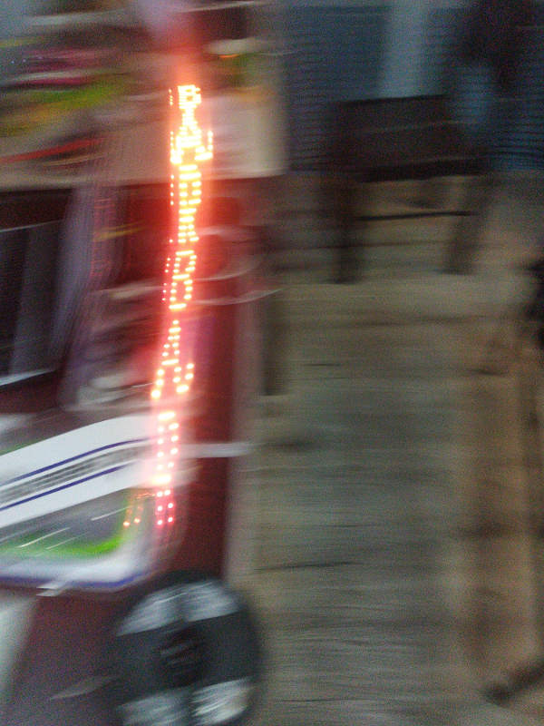

# LED Strip Persistence of Vision #

This is an experiment with persistence of vision (POV) using an Arduino Nano and a WS2812 LED strip.  The inspiration for this project came from watching a demonstration of BlinkyTape by [Matt Metz of Blinkinlabs](https://github.com/orgs/Blinkinlabs/people) at Seeed in Shenzhen.  The POV effect can be seen out of the corner of the eye when turning one's head, or by shaking one's head while looking at it.

His hardware and software tooling is waaaay more polished than mine, and I suggest checking Blinklinlabs if you want to get up and running quickly.

## Creating a custom image header ##

The included python script reads an RGB picture file and outputs a custom image header file for use by the project.  The number of height pixels determines the amount of LEDs that will be needed in the strip.  Usage:
```
$ git clone git@github.com:chrrrles/BarBar.git
$ cd BarBar
$ pip install -r requirements.txt # to install the PIL/pillow library
$ python create_image_header.py ~/your_custom_image.png > image.h
```

After this, open the project in the Arduino IDE, compile and upload to a board.

## Example ##

Here is what the strip looks like at rest:


And when moving one's head:


